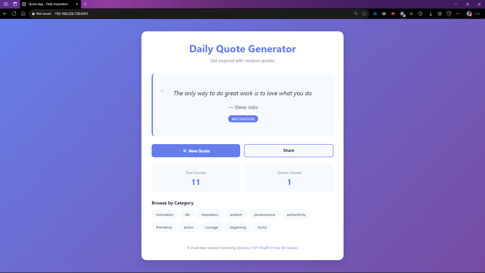

# Quote App - Complete DevOps CI/CD Project


> A production-grade random quote generator demonstrating end-to-end DevOps practices including automated CI/CD pipelines, container orchestration, infrastructure as code, and comprehensive monitoring.

**Live Demo:** [Docker Hub Repository](https://hub.docker.com/r/adityajareda/quote-app)

---

## Table of Contents

- [Overview](#overview)
- [Architecture](#architecture)
- [Features](#features)
- [Tech Stack](#tech-stack)
- [Quick Start](#quick-start)
- [Documentation](#documentation)
- [Deployment](#deployment)
- [Monitoring](#monitoring)
- [CI/CD Pipeline](#cicd-pipeline)
- [API Documentation](#api-documentation)
- [Project Structure](#project-structure)
- [Development](#development)
- [Testing](#testing)
- [Infrastructure as Code](#infrastructure-as-code)
- [Roadmap](#roadmap)
- [Contributing](#contributing)
- [License](#license)
- [Author](#author)

---

## Overview

This project demonstrates a complete DevOps workflow from development to production, showcasing modern cloud-native practices and tools. Built as a learning project, it covers all aspects of the DevOps lifecycle.

### What Makes This Project Unique

- **Full DevOps Lifecycle**: From code to production
- **Infrastructure as Code**: Terraform for reproducible infrastructure
- **Automated CI/CD**: GitHub Actions with multi-stage pipeline
- **Container Orchestration**: Kubernetes with autoscaling
- **Comprehensive Monitoring**: Prometheus + Grafana metrics
- **Security Scanning**: Automated vulnerability detection
- **Production-Ready**: Health checks, logging, resource limits

---

## Screenshots

**Homepage - Random Quote Display**


*Clean, responsive UI with random quote generation*

---

## Architecture

### High-Level Architecture
```
┌─────────────────────────────────────────────────────────────────┐
│                         GitHub Repository                        │
│                    (Source Code + CI/CD)                        │
└────────────────────────────┬────────────────────────────────────┘
                             │
                    ┌────────▼─────────┐
                    │  GitHub Actions  │
                    │   CI/CD Pipeline │
                    └────────┬─────────┘
                             │
              ┌──────────────┼──────────────┐
              │              │              │
        ┌─────▼─────┐  ┌────▼────┐  ┌─────▼──────┐
        │   Test    │  │  Build  │  │   Security │
        │  (Jest)   │  │ (Docker)│  │   (Trivy)  │
        └───────────┘  └────┬────┘  └────────────┘
                            │
                    ┌───────▼────────┐
                    │   Docker Hub   │
                    │  Image Registry│
                    └───────┬────────┘
                            │
              ┌─────────────┼─────────────┐
              │             │             │
        ┌─────▼─────┐ ┌────▼──────┐ ┌───▼────────┐
        │   Local   │ │ Kubernetes│ │  Terraform │
        │   Docker  │ │  Cluster  │ │    IaC     │
        └───────────┘ └────┬──────┘ └────────────┘
                           │
              ┌────────────┼────────────┐
              │            │            │
        ┌─────▼─────┐ ┌───▼────┐ ┌────▼─────┐
        │   Pods    │ │ Service│ │    HPA   │
        │  (2-10)   │ │ (LB)   │ │(Autoscale)│
        └─────┬─────┘ └────────┘ └──────────┘
              │
        ┌─────▼──────┐
        │ Prometheus │
        │  Grafana   │
        └────────────┘
```

### Component Interaction
```
User → Service (NodePort/Ingress) → Pods (Quote App) → Metrics
                                         │
                                         ▼
                                    Prometheus
                                         │
                                         ▼
                                     Grafana
```

---

## Features

### Application Features
- Random quote generation with 10+ categories
- RESTful API with 7 endpoints
- Category-based filtering
- Statistics tracking
- Share functionality
- Keyboard shortcuts
- Fully responsive design

### DevOps Features
- Automated CI/CD pipeline
- Multi-stage Docker builds
- Kubernetes orchestration
- Horizontal pod autoscaling (2-10 replicas)
- Infrastructure as code (Terraform)
- Real-time monitoring (Prometheus + Grafana)
- Security scanning (Trivy)
- Automated testing (Jest)
- Health checks and probes
- Resource limits and requests
- Rolling updates with zero downtime
- Multi-platform Docker builds (amd64, arm64)

---

## Tech Stack

### Application Layer
- **Runtime**: Node.js 18.x
- **Framework**: Express.js 4.18
- **Frontend**: HTML5, CSS3, Vanilla JavaScript
- **Testing**: Jest, Supertest

### Infrastructure Layer
- **Containerization**: Docker, Docker Compose
- **Orchestration**: Kubernetes (Minikube)
- **IaC**: Terraform
- **CI/CD**: GitHub Actions
- **Registry**: Docker Hub

### Monitoring & Observability
- **Metrics**: Prometheus
- **Visualization**: Grafana
- **Logging**: Built-in Node.js logging
- **Health Checks**: Liveness and readiness probes

### Security
- **Scanning**: Trivy
- **Container Security**: Non-root user, read-only filesystem
- **Secrets Management**: Kubernetes secrets, GitHub secrets

---

## Quick Start

### Prerequisites

- Node.js 18.x or higher
- Docker 24.x or higher
- kubectl (for Kubernetes)
- Minikube (for local Kubernetes)
- Terraform 1.0+ (optional)

### Run Locally (Development)
```bash
# Clone repository
git clone https://github.com/AdityaJareda/quote-app-devops.git
cd quote-app-devops

# Install dependencies
npm install

# Start development server
npm run dev

# Access at http://localhost:3000
```

### Run with Docker
```bash
# Pull from Docker Hub
docker pull adityajareda/quote-app:latest

# Run container
docker run -p 3000:3000 adityajareda/quote-app:latest

# Or use Docker Compose
docker compose up -d
```

### Deploy to Kubernetes
```bash
# Start Minikube
minikube start

# Apply manifests
kubectl apply -f k8s/

# Access application
minikube service quote-app-service -n quote-app --url
```

---

## Documentation

Comprehensive guides available:

- **[DEPLOYMENT.md](DEPLOYMENT.md)** - Complete deployment guide
- **[KUBERNETES.md](KUBERNETES.md)** - Kubernetes quick reference
- **[k8s/README.md](k8s/README.md)** - Kubernetes manifests documentation
- **[terraform/README.md](terraform/README.md)** - Terraform usage guide
- **[monitoring/README.md](monitoring/README.md)** - Monitoring setup
- **[TROUBLESHOOTING.md](TROUBLESHOOTING.md)** - Common issues and solutions

---

## Deployment

### Docker Deployment
```bash
# Development
docker compose -f docker-compose.dev.yml up

# Production
docker compose up -d
```

### Kubernetes Deployment
```bash
# Deploy to Kubernetes
kubectl apply -f k8s/

# Scale manually
kubectl scale deployment quote-app-deployment -n quote-app --replicas=5

# Check autoscaler
kubectl get hpa -n quote-app

# View logs
kubectl logs -n quote-app -l app=quote-app
```

### Terraform Deployment
```bash
# Docker deployment
cd terraform/environments/dev
terraform init
terraform apply

# Kubernetes deployment
cd terraform/environments/prod
terraform init
terraform apply
```

See [terraform/README.md](terraform/README.md) for details.

---

## Monitoring

### Access Monitoring Dashboards

**Prometheus:**
```bash
kubectl port-forward -n monitoring svc/prometheus-server 9090:80
# Access: http://localhost:9090
```

**Grafana:**
```bash
kubectl port-forward -n monitoring svc/grafana 3001:80
# Access: http://localhost:3001
# Login: admin / admin123
```

### Custom Metrics

The application exposes metrics at `/metrics`:

- `http_requests_total` - Total HTTP requests by method, route, status
- `http_request_duration_seconds` - Request latency histogram
- `quotes_served_total` - Total quotes served by endpoint
- `process_*` - Node.js process metrics
- `nodejs_*` - Node.js runtime metrics

### Sample Prometheus Queries
```promql
# Request rate
rate(http_requests_total[5m])

# 95th percentile latency
histogram_quantile(0.95, rate(http_request_duration_seconds_bucket[5m]))

# Total quotes served
sum(quotes_served_total)

# Pod CPU usage
rate(container_cpu_usage_seconds_total{namespace="quote-app"}[5m])
```

---

## CI/CD Pipeline

### Pipeline Stages
```
Code Push → GitHub Actions
    │
    ├─→ Stage 1: Test (Jest, Coverage)
    │       └─→ Upload coverage to Codecov
    │
    ├─→ Stage 2: Build & Push (Docker, Multi-arch)
    │       └─→ Push to Docker Hub
    │
    ├─→ Stage 3: Security Scan (Trivy)
    │       └─→ Upload to GitHub Security
    │
    └─→ Stage 4: Notify (Deployment summary)
```

### Workflow Features

- Automated testing on every push
- Multi-platform Docker builds (amd64, arm64)
- Security vulnerability scanning
- Automated image publishing
- Branch protection rules
- Status badges

### Triggering Builds
```bash
# Push to main triggers full pipeline
git push origin main

# Create PR for review
git checkout -b feature/new-feature
git push origin feature/new-feature
# Create PR on GitHub
```

View pipeline status: [GitHub Actions](https://github.com/AdityaJareda/quote-app-devops/actions)

---

## API Documentation

### Base URL
```
http://localhost:3000
```

### Endpoints

| Method | Endpoint | Description | Example |
|--------|----------|-------------|---------|
| GET | `/health` | Health check | Returns server status |
| GET | `/metrics` | Prometheus metrics | Returns application metrics |
| GET | `/api/quotes` | Get all quotes | Supports `?page=1&limit=10` |
| GET | `/api/quotes/random` | Get random quote | Returns one random quote |
| GET | `/api/quotes/:id` | Get quote by ID | `/api/quotes/1` |
| GET | `/api/quotes/category/:cat` | Filter by category | `/api/quotes/category/motivation` |
| GET | `/api/categories` | Get all categories | Returns available categories |
| POST | `/api/quotes` | Add new quote | Body: `{text, author, category}` |

### Example Request
```bash
curl http://localhost:3000/api/quotes/random
```

### Example Response
```json
{
  "id": 1,
  "text": "The only way to do great work is to love what you do.",
  "author": "Steve Jobs",
  "category": "motivation"
}
```

---

## Project Structure
```
quote-app-devops/
├── .github/
│   └── workflows/
│       ├── ci-cd.yml           # GitHub Actions pipeline
│       └── health-check.yml    # Health Check pipeline
├── k8s/                        # Kubernetes manifests
│   ├── namespace.yaml
│   ├── configmap.yaml
│   ├── deployment.yaml
│   ├── service.yaml
│   ├── hpa.yaml
│   └── README.md
├── terraform/                  # Infrastructure as Code
│   ├── modules/
│   │   ├── docker/
│   │   └── kubernetes/
│   ├── environments/
│   │   ├── dev/
│   │   └── prod/
│   └── README.md
├── monitoring/                 # Monitoring configuration
│   ├── prometheus-values.yaml
│   ├── grafana-values.yaml
│   ├── quote-app-dashboard.json
│   └── README.md
├── src/                        # Application source
│   ├── app.js
│   ├── routes/
│   ├── controllers/
│   └── data/
│       └── quotes.json
├── public/                     # Frontend files
│   ├── index.html
│   ├── style.css
│   └── script.js
├── tests/                      # Test files
│   └── app.test.js
├── docs/                       # Documentation
│   └── DOCKER.md
├── Dockerfile                  # Multi-stage Docker build
├── docker-compose.yml          # Compose configuration
├── package.json                # Node.js dependencies
├── jest.config.js              # Test configuration
├── DEPLOYMENT.md               # Deployment guide
├── TROUBLESHOOTING.md          # Troubleshooting docker
└── README.md                   # This file
```

---

## Development

### Local Development Setup
```bash
# Install dependencies
npm install

# Start dev server (with auto-reload)
npm run dev

# Run tests
npm test

# Run tests in watch mode
npm run test:watch

# Check code coverage
npm test -- --coverage
```

### Environment Variables

Create `.env` file:
```env
PORT=3000
NODE_ENV=development
APP_NAME=Quote App
APP_VERSION=1.0.0
LOG_LEVEL=debug
```

### Code Quality
```bash
# Run linter (if configured)
npm run lint

# Format code (if configured)
npm run format
```

---

## Testing

### Test Coverage

- **14 passing tests**
- **85%+ code coverage**

### Test Categories

- Unit tests for all API endpoints
- Integration tests for request/response cycle
- Error handling tests
- Validation tests

### Running Tests
```bash
# Run all tests
npm test

# Watch mode
npm run test:watch

# Coverage report
npm test -- --coverage

# View HTML coverage report
open coverage/index.html
```

---

## Infrastructure as Code

### Terraform Modules

- **Docker Module**: Container deployments
- **Kubernetes Module**: Orchestrated deployments

### Environments

- **Development**: Docker-based local environment
- **Production**: Kubernetes cluster deployment

### Usage
```bash
# Development environment
cd terraform/environments/dev
terraform init
terraform plan
terraform apply

# Production environment
cd terraform/environments/prod
terraform init
terraform plan
terraform apply
```

See [terraform/README.md](terraform/README.md) for detailed documentation.

---

## Roadmap

### Completed
- [x] Full-stack application
- [x] RESTful API with 7 endpoints
- [x] Comprehensive testing (14 tests, 85%+ coverage)
- [x] Docker containerization
- [x] Docker Compose setup
- [x] Published to Docker Hub
- [x] GitHub Actions CI/CD
- [x] Security scanning
- [x] Multi-platform builds
- [x] Kubernetes deployment
- [x] Horizontal Pod Autoscaler
- [x] Health checks and probes
- [x] Terraform IaC
- [x] Prometheus monitoring
- [x] Grafana dashboards

---

## Contributing

This is a learning project, but contributions are welcome!

### How to Contribute

1. Fork the repository
2. Create a feature branch (`git checkout -b feature/amazing-feature`)
3. Commit your changes (`git commit -m 'feat: Add amazing feature'`)
4. Push to the branch (`git push origin feature/amazing-feature`)
5. Open a Pull Request

### Commit Convention

Follow [Conventional Commits](https://www.conventionalcommits.org/):

- `feat:` New feature
- `fix:` Bug fix
- `docs:` Documentation changes
- `test:` Test updates
- `ci:` CI/CD changes
- `refactor:` Code refactoring
- `chore:` Maintenance tasks

---

## License

This project is licensed under the MIT License - see the [LICENSE](LICENSE) file for details.

---

## Author

**Aditya Singh**

- GitHub: [@AdityaJareda](https://github.com/AdityaJareda)
- LinkedIn: [Aditya Singh](https://www.linkedin.com/in/adityajareda)
---

## Acknowledgments

- Built as part of my DevOps learning journey
- Inspired by modern DevOps best practices
- Quote data from public domain

---

## Project Statistics

- **Lines of Code**: 2,500+
- **Docker Image Size**: ~150MB
- **Test Coverage**: 85%+
- **Kubernetes Resources**: 6 manifests
- **Terraform Modules**: 2 (Docker, Kubernetes)
- **CI/CD Stages**: 4
- **API Endpoints**: 7
- **Monitoring Metrics**: 10+
- **Documentation Pages**: 7

---

## Additional Resources

- [Docker Documentation](https://docs.docker.com/)
- [Kubernetes Documentation](https://kubernetes.io/docs/)
- [Terraform Documentation](https://www.terraform.io/docs)
- [GitHub Actions Documentation](https://docs.github.com/en/actions)
- [Prometheus Documentation](https://prometheus.io/docs/)
- [Grafana Documentation](https://grafana.com/docs/)

---

A small step toward mastering DevOps.
